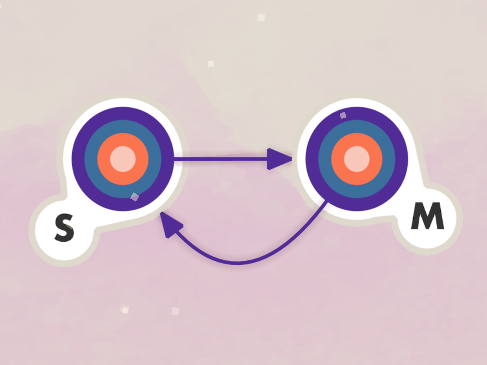

## Automata -  WWDC 2020 Submission

    

    

This reposotory stores the project I submitted for the WWDC 2020 Swift Student Challenge. 

Automata introduces the attributes and behaviours of Finite State Machines in a gamified playgroundbook.

A video for the Playground running can be found on [youtube](https://youtu.be/DXYMysxA7HU)

If you have a question about the project, or WWDC and Scholarship in general, I would be happy to help! You can message me at my [linkedin](https://www.linkedin.com/in/phbgomes )! 

**Be kind to others!** Best regards!
